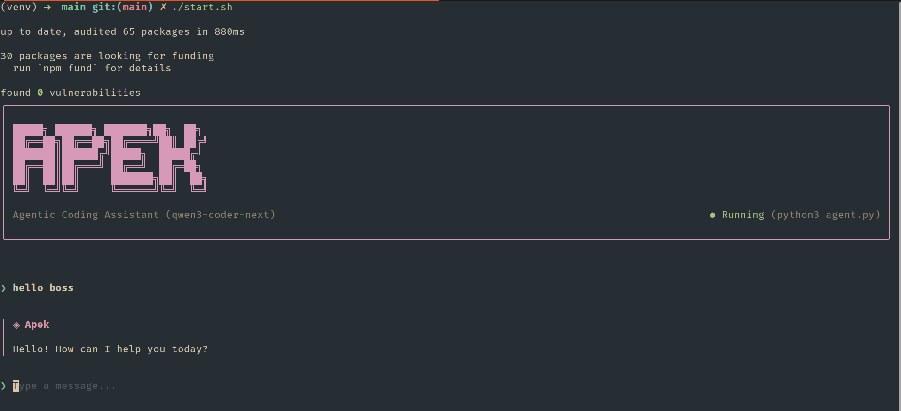

# Apek — Coding Agent

---

## Preview



---

## Prerequisites

| Requirement    | Version                                          |
| -------------- | ------------------------------------------------ |
| Python         | 3.10+                                            |
| Node.js + npm  | 18+                                              |
| Ollama API Key | [Get one here](https://ollama.com/settings/keys) |

---

## Setup

### 1. Navigate to the project root

```bash
cd apex
```

---

### 2. Configure environment variables

**Linux / macOS**

```bash
cp .env.example .env
```

**Windows (PowerShell)**

```powershell
Copy-Item .env.example .env
```

Then open `.env` and fill in your values:

```env
OLLAMA_BASE_URL=https://ollama.com/api
OLLAMA_CHAT_PATH=/chat
OLLAMA_API_KEY=your_api_key_here
OLLAMA_MODEL=qwen3-coder-next
```

---

### 3. Create and activate a virtual environment

**Linux / macOS**

```bash
python3 -m venv venv
source venv/bin/activate
```

**Windows (PowerShell)**

```powershell
py -m venv venv
.\venv\Scripts\Activate.ps1
```

**Windows (CMD)**

```bat
py -m venv venv
venv\Scripts\activate.bat
```

---

### 4. Install UI dependencies

```bash
cd ui
npm install
cd ..
```

---

## Running the App

### Linux / macOS (recommended)

```bash
chmod +x start.sh
./start.sh
```

Each `./start.sh` run creates one timestamped debug trace at:

`error-logs/run_YYYYMMDD_HHMMSS_RANDOM.txt`

This file includes timestamps plus detailed runtime events (user inputs, model responses, tool calls, tool results, and API request/response tracing).

### Windows (PowerShell or CMD)

```bash
cd ui
npx tsx src/App.tsx
```

> **Note:** The UI starts the Python backend automatically.

---

## Configuration

### Custom Python binary

If your system uses a non-default Python command, set `PYTHON_BIN` before starting.

**Linux / macOS**

```bash
export PYTHON_BIN=python3
```

**Windows (PowerShell)**

```powershell
$env:PYTHON_BIN = "py"
```

### Projects root path

By default, the agent uses this resolution order for project files:

1. `APEK_PROJECTS_ROOT` (or `PROJECTS_ROOT`) if set
2. `/projects`
3. `~/projects` (fallback if `/projects` is not writable)

To force your preferred path (example: `/home/prawesh/projects`):

```bash
export APEK_PROJECTS_ROOT=/home/prawesh/projects
```

Windows PowerShell:

```powershell
$env:APEK_PROJECTS_ROOT = "C:\\Users\\<you>\\projects"
```

---
